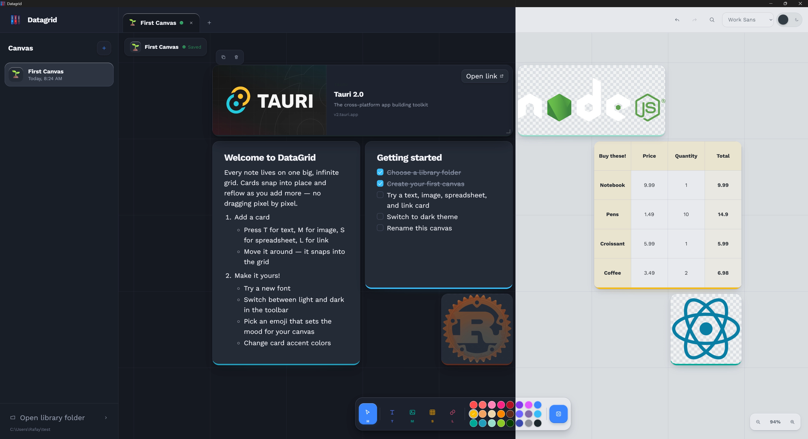

<p align="center">
  
</p>

<h1 align="center">Data Grid</h1>

<p align="center">
  A private, local-first note-taking app built around an infinite snapping grid.
</p>

<p align="center">
  Arrange text, images, spreadsheets, and links as portable cards without giving up ownership of your files.
</p>

---

## Overview

Datagrid replaces the freeform "sticky notes on a canvas" model with a structured two-dimensional grid. Cards snap into evenly spaced slots, reflow around one another as you add and move content, and stay directly editable on the canvas — no separate editor window.

Every canvas is saved as a single OpenDocument Text (`.odt`) file containing its layout, text, images, link previews, and embedded spreadsheets, so your notes stay readable outside Datagrid too.

## Features

**Canvas**
- Infinite panning and zooming grid canvas
- Cards snap into a grid and reflow automatically as the layout changes
- Multiple canvases open at once, each in its own tab
- Per-canvas emoji labels
- In-canvas search (`Ctrl+F`)
- Full undo and redo history (`Ctrl+Z` / `Ctrl+Y`)

**Cards**
- Text cards with headings, bold, italic, and lists
- Image cards
- Spreadsheet cards with formulas and calculated columns
- Link cards with automatically fetched previews and accent colors
- Quick-switch tool shortcuts: select (`H`), text (`T`), image (`M`), spreadsheet (`S`), link (`L`)

**Appearance**
- Light and dark themes
- Adjustable interface scale and font, with four bundled variable typefaces (DM Sans, Figtree, Manrope, Work Sans)

**Storage & privacy**
- You choose a local library folder — Datagrid never uploads canvas data anywhere
- Each canvas is a portable, standards-based `.odt` file that other OpenDocument software can open
- Offline-first; the only feature that touches the network is fetching a link preview, and the result is cached inside the canvas afterward

## Installation

### Windows installer

1. Open the repository's [Releases](https://github.com/rafay-pk/datagrid/releases) page.
2. Download the latest Datagrid installer.
3. Run the installer.
4. Launch Datagrid from the Start menu.

Windows may display a warning for unsigned applications. Review the downloaded file and repository before continuing.

macOS and Linux users can run Datagrid from source using the development instructions below; see [Portability](#portability) for a note on cross-platform release builds.

## Demo data

A sample canvas is available to see Datagrid's card types and grid layout without starting from a blank canvas.

1. Download [demo-data.odt](demo-data.odt).
2. Choose (or open) your library folder.
3. Copy the downloaded file into that folder.
4. Restart Datagrid, or reopen the library folder, so it picks up the new file — then open it from the canvas list.

Datagrid doesn't watch the library folder for changes made outside the app, so files added directly to the folder only appear after a refresh.

## Development

Datagrid is built with [Tauri 2](https://tauri.app), React 19, TypeScript, and Vite on the frontend, with a Rust backend that handles canvas storage, ODT file generation, and link preview fetching.

### Requirements

All platforms need:

- [Node.js](https://nodejs.org/) 18 or later
- [Rust](https://www.rust-lang.org/tools/install) (via `rustup`)

Plus the platform-specific toolchain below, matching [Tauri's prerequisites](https://v2.tauri.app/start/prerequisites/).

<details>
<summary><strong>Windows</strong></summary>

- Rust with the MSVC toolchain (the default target when installing via `rustup` on Windows)
- [Microsoft C++ Build Tools](https://visualstudio.microsoft.com/visual-cpp-build-tools/) — install the "Desktop development with C++" workload
- WebView2 Runtime (preinstalled on Windows 11; installable separately on Windows 10)

</details>

<details>
<summary><strong>macOS</strong></summary>

- Xcode Command Line Tools:

  ```bash
  xcode-select --install
  ```

- Rust via `rustup` (the default toolchain works)

</details>

<details>
<summary><strong>Linux</strong></summary>

Install WebKitGTK and the standard build toolchain for your distribution.

**Debian / Ubuntu**

```bash
sudo apt update && sudo apt install -y libwebkit2gtk-4.1-dev build-essential curl wget file libxdo-dev libssl-dev libayatana-appindicator3-dev librsvg2-dev
```

**Fedora**

```bash
sudo dnf install -y webkit2gtk4.1-devel openssl-devel curl wget file libappindicator-gtk3-devel librsvg2-devel libxdo-devel && sudo dnf group install -y "c-development"
```

**Arch**

```bash
sudo pacman -Syu --needed webkit2gtk-4.1 base-devel curl wget file openssl appmenu-gtk-module libappindicator-gtk3 librsvg xdotool
```

</details>

### Run locally

```bash
git clone https://github.com/rafay-pk/datagrid.git
cd datagrid
npm install
npm run tauri dev
```

This launches Datagrid in development mode with hot reload on every supported platform.

### Create a release build

```bash
npm run tauri build
```

On Windows, `release.ps1` wraps this into a single versioned command:

```powershell
.\release.ps1 0.1.0
```

Installers are generated under `src-tauri/target/release/bundle/`.

> **Note:** `src-tauri/tauri.conf.json` currently restricts `bundle.targets` to `nsis`, so `npm run tauri build` only produces a Windows installer today. To package a `.dmg`/`.app` on macOS or a `.deb`/`.rpm`/AppImage on Linux, update the `targets` array for your platform before building. That gap is a great first pull request if you're set up on macOS or Linux.

## Data and privacy

Datagrid does not require an account. Canvas files remain in the library folder selected by the user, and no canvas data is sent to a Datagrid service.

Link previews require a network connection when first collected. Their metadata and preview images are then stored inside the canvas for offline use.

## Portability

Datagrid canvases are standard `.odt` files with embedded spreadsheet documents and images. Other OpenDocument applications can access the underlying content even when they do not understand Datagrid's spatial layout.

## Contributing

Contributions are very welcome, including pull requests — bug fixes, features, and documentation improvements are all appreciated. For larger changes, opening an issue first is a good way to check direction before you invest time, but small fixes are welcome as a PR directly.

## License

Datagrid is released under the [PolyForm Noncommercial License 1.0.0](LICENSE.md).
